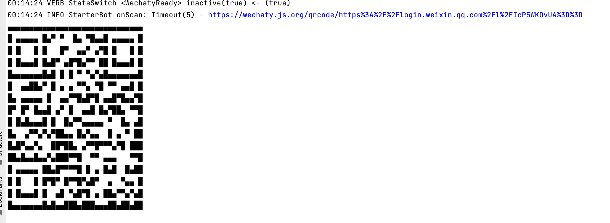

# SapienAlpha Wechat Bot

## prod路径：C:\\wechatbot\\wechatbot

## 一、编译&运行
0. 安装 Node.jS (>=10)
1. clone 代码
```text
git clone git@github.com:SapienAlpha/wechatbot.git
cd wechatbot
```
2. 安装依赖
```text
npm install
```
3. 运行
```text
./run.sh
```
4. 停止
   1. windows server上停止任务
    ```text
    cmd中执行命令查找进程id
   tasklist /v
   杀死进程
   taskkill pid -f
    ```
   2. linux server上停止任务
    ```text
    ps -ef|grep node
    找到Main.js的进程
    kill -9 进程号
    ```

运行成功后，你可以看到下面的界面：

打开日志中的链接（日志中的二维码扫描识别速度较慢），扫码登录。
